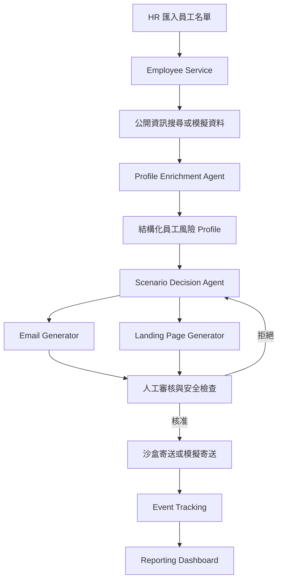

# AI 個人化釣魚演練平台：MVP 設計與執行規劃

> ⚠️ **實作契約以 `docs/api-contract.md` 與 `backend/schema.sql` 為準（Frozen）。**
> 本文件為背景規劃，其中的型別、Campaign 狀態、TrackingEvent 形狀、API 範例若與上述二份不一致，一律以上述二份為準，不得作為實作依據。
>
> 文件狀態：Draft for Hackathon MVP
>
> 建立日期：2026-09-12
>
> 預計開發時間：一個下午（約 4–5 小時）
> 團隊規模：3 人

## 1. 專案摘要

本專案預計建立一套「可安全展示的 AI 社交工程演練平台」。HR 或資安管理者匯入經授權的員工基本資料後，系統會使用公開資訊或預先準備的模擬資料豐富員工 Profile，並由 AI Agent 根據可追溯的資訊選擇適合的演練情境、生成演練信件與安全落地頁。

管理者必須先人工審核並核准內容，系統才會進行沙盒寄送或模擬寄送。平台最後記錄開信、點擊、表單嘗試與教育頁閱讀等事件，產出個人與組織層級的演練成效報告。

本 MVP 的價值不只是「AI 生成釣魚內容」，而是建立一個具備資料來源、決策理由、人工審核、安全護欄及結果回饋的完整演練閉環。

## 2. 目標與非目標

### 2.1 MVP 目標

1. 匯入 5–20 位虛構或已取得授權的員工資料。
2. 對單一員工執行公開資訊或模擬資料的 Profile Enrichment。
3. 產生包含來源、可信度與風險訊號的結構化 Profile。
4. 由 Agent 從固定模板中選擇演練情境並說明理由。
5. 生成可供管理者預覽的演練信件及安全落地頁。
6. 經人工核准後進行沙盒寄送或模擬寄送。
7. 記錄演練互動事件並顯示成效 Dashboard。
8. 在 Demo 中完整走過一條端到端流程。

### 2.2 本階段非目標

- 不建立大規模或通用型 OSINT 爬蟲平台。
- 不建立任意網站複製或高擬真登入頁生成器。
- 不對未經授權的真實對象寄送內容。
- 不收集或保存真實密碼、MFA、Token 或金融資料。
- 不開發郵件安全規避、反偵測或繞過能力。
- 不允許 AI 內容在未經人工核准的情況下自動寄送。
- 不在 Hackathon 階段處理大型組織、多租戶或正式權限治理。

## 3. 使用者與主要情境

### 3.1 管理者／HR／資安人員

- 匯入員工清單。
- 檢視員工 Profile 及公開資訊來源。
- 檢視 Agent 選擇的情境及判斷理由。
- 預覽、核准或拒絕演練內容。
- 啟動模擬 Campaign。
- 查看個人及整體演練結果。

### 3.2 演練參與者

- 收到沙盒或內部測試信件。
- 開啟郵件並點擊演練連結。
- 在安全落地頁上進行互動。
- 在提交後立即看到演練揭露與資安教育內容。

## 4. MVP 使用流程

1. 管理者上傳員工 CSV。
2. 系統建立員工基本資料。
3. 管理者選擇一位員工執行 Profile Enrichment。
4. 系統取得公開資訊或載入固定的示範搜尋結果。
5. Profile Agent 產生可追溯的公開事實、風險訊號與建議情境。
6. Scenario Agent 從允許的模板中選擇演練類型與難度。
7. 系統生成 Email HTML 與 Landing Page 設定。
8. 管理者人工預覽並核准 Campaign。
9. 系統執行沙盒寄送或模擬寄送。
10. 參與者開信、點擊或嘗試提交表單。
11. 系統記錄事件，但不保存輸入欄位值。
12. Dashboard 顯示演練結果與轉換漏斗。

## 5. 系統架構



### 5.1 建議技術選型

為降低整合成本，優先採用團隊最熟悉的技術。建議選項如下：

- 前端：React／Next.js，透過 REST API 與後端整合。
- Backend：Golang 單體 API Service；MVP 建議採用 `net/http` 搭配 `chi` Router。
- 資料存取：Go `database/sql` 搭配 SQLite Driver；Hackathon 階段直接撰寫少量 SQL，避免導入過重 ORM。
- 資料庫：SQLite，以 Migration SQL 建立 Schema。
- AI：支援 JSON Schema 或 Structured Output 的 LLM API。
- Email：本機 Mailpit／MailHog、測試信箱，或純 UI 模擬寄送。
- Landing Page：由固定 React／HTML 模板依 Campaign 設定渲染。
- 圖表：Recharts、Chart.js，或簡單 CSS 統計卡及漏斗。

後端維持單一 Go Process，將 Employee、Profile、Campaign、Tracking 與 Report 依 Package 分層，不在 MVP 階段拆成 Microservices。前端可獨立運行，或在 Build 後由 Go 以 `embed` 提供靜態檔案；若時間不足，優先採前後端分開啟動以降低整合複雜度。

### 5.2 建議 Go 後端結構

```text
backend/
├── cmd/api/main.go               # 啟動 HTTP Server、依賴注入
├── internal/config/              # 環境設定
├── internal/httpapi/             # Router、Handler、Middleware
├── internal/employee/            # 員工匯入與查詢
├── internal/profile/             # Profile Enrichment 流程
├── internal/campaign/            # Agent 決策、核准與狀態機
├── internal/tracking/            # Tracking Token 與事件紀錄
├── internal/report/              # 聚合報表
├── internal/agent/               # LLM Client、Prompt、結構驗證
├── internal/store/               # database/sql Repository
├── migrations/                   # SQLite Migration SQL
└── fixtures/                     # Demo 搜尋及 Agent 回應資料
```

Go 後端實作原則：

- Handler 只負責 HTTP 輸入輸出，流程規則放在 Service。
- Repository 封裝 `database/sql`，避免業務邏輯直接依賴 SQL。
- 所有外部呼叫使用 `context.Context` 並設定 Timeout。
- LLM 與搜尋服務以 Interface 隔離，Demo 可切換成 Fixture Adapter。
- 使用 `encoding/json` 解碼後，再執行結構及安全規則驗證。
- 錯誤回應採統一 JSON 格式並帶有可追蹤的 Request ID。
- Token、API Key 與連線資訊只從環境變數讀取，不寫入 Repository。

## 6. 模組設計

### 6.1 管理台前端

必要頁面：

1. 員工清單與 CSV 匯入。
2. 員工 Profile 與公開資訊來源。
3. Agent 決策與生成內容預覽。
4. Campaign 核准及狀態頁。
5. 演練報告 Dashboard。

前端應清楚標示資料狀態：

- `source-backed`：有來源支持的公開事實。
- `inferred`：模型推論，不應當成已確認事實。
- `mock`：Hackathon 用模擬資料。
- `rejected`：被安全規則或管理者拒絕的內容。

### 6.2 Employee Service

負責：

- 解析 CSV。
- 建立員工資料。
- 避免重複匯入。
- 提供員工清單及詳細資料。
- 控制哪些欄位可以交由 Agent 使用。

CSV 建議欄位：

```csv
employee_id,display_name,email,department,title,company
E001,Demo User,demo.user@example.test,Engineering,Software Engineer,Demo Corp
```

### 6.3 Profile Enrichment Agent

輸入：

- 姓名。
- 職稱。
- 部門。
- 公司。
- HR 明確允許使用的公司資訊。
- 搜尋取得或預先準備的公開資料。

輸出範例：

```json
{
  "employeeId": "E001",
  "publicFacts": [
    {
      "fact": "近期參加公開技術研討會",
      "sourceUrl": "https://example.com/event",
      "confidence": 0.88
    }
  ],
  "riskSignals": [
    "可能較容易受到活動通知類演練情境影響"
  ],
  "recommendedScenario": "event_followup",
  "dataMinimizationNotes": [
    "未保存非必要的家庭或私人資訊"
  ]
}
```

設計原則：

- 每項公開事實必須附來源 URL。
- 來源不足時輸出 `unknown`，不可補寫成事實。
- 信心值只表示模型或檢索信心，不表示絕對真實。
- 風險訊號必須使用「可能」等推論用語。
- 不收集家庭、健康、宗教、政治、財務困難等敏感資訊。
- 搜尋服務不穩定時，使用固定 Fixture 保證 Demo 流程。

### 6.4 Scenario Decision Agent

為控制安全性及開發範圍，Agent 不自由建立任意攻擊方式，而是從核准模板中選擇情境並填入有限欄位。

建議模板：

- `event_followup`：公開活動後續通知。
- `training_reminder`：內部教育訓練提醒。
- `benefit_update`：一般福利方案更新。
- `saas_security_notice`：測試用 SaaS 帳號安全提醒。

輸出範例：

```json
{
  "templateId": "training_reminder",
  "difficulty": "medium",
  "personalizationFields": {
    "department": "Engineering",
    "topic": "AI security workshop"
  },
  "reason": "職務與公開活動資料吻合",
  "riskFlags": []
}
```

禁止情境：

- 假冒政府、銀行或醫療單位。
- 利用家人、疾病、債務、財務困難等敏感資訊。
- 威脅、勒索或造成強烈心理壓力。
- 要求提供真實密碼、MFA 或金融資料。
- 使用未經 HR 核准的個人資料。

### 6.5 Email Generator

Email 使用固定模板搭配受控欄位：

```text
Email Template
├── Subject
├── Greeting
├── Scenario-specific Body
├── Call-to-action Button
└── Tracking Token
```

MVP 至少提供：

- HTML 預覽。
- 純文字預覽。
- Agent 選擇理由。
- 使用資料來源摘要。
- 安全規則檢查結果。
- 核准與拒絕操作。

### 6.6 Landing Page Generator

Landing Page 使用固定版型及設定資料渲染：

```text
Landing Page Template
├── Campaign 標題與測試品牌
├── 說明文字
├── Dummy Form
├── Event Recorder
└── Training Reveal Page
```

安全要求：

- 表單欄位值不得傳送至後端。
- 系統只記錄 `form_attempted=true`。
- 提交後立即顯示演練揭露及教育內容。
- 不複製真實服務的 Logo、網域或登入頁到足以混淆來源。
- URL 不包含姓名、Email 或其他直接個資。

### 6.7 Campaign Service

Campaign 狀態建議：

```text
draft → pending_review → approved → simulated → completed
              └────────→ rejected
```

狀態規則：

- `draft`：Agent 已產生內容。
- `pending_review`：等待管理者檢查。
- `approved`：通過人工審核。
- `rejected`：內容被拒絕，不可寄送。
- `simulated`：已完成沙盒或模擬寄送。
- `completed`：已結束並可產生報告。

任何寄送操作都必須驗證狀態為 `approved`。

### 6.8 Event Tracking

MVP 最小事件集合：

```text
email_generated
campaign_approved
email_sent_simulated
email_opened
link_clicked
form_attempted
training_viewed
```

每個演練連結使用不可預測且不含個資的 tracking token。後端再將 token 對應至 Campaign Target。

應避免依賴開信率作為唯一判斷，因為郵件代理或圖片預載可能造成誤判。Demo 報告可將「開信」標示為參考指標，將點擊及頁面互動視為較可信事件。

### 6.9 Reporting Dashboard

Dashboard 至少顯示：

- 目標人數。
- 已模擬寄送數。
- 開信數及比例。
- 點擊數及比例。
- 表單嘗試數及比例。
- 教育頁閱讀數及比例。
- 事件時間軸。

建議漏斗：

```text
寄送 → 開信 → 點擊 → 表單嘗試 → 教育頁閱讀
```

## 7. 資料模型

建議資料表：

### `employees`

| 欄位 | 說明 |
|---|---|
| `id` | 內部主鍵 |
| `employee_id` | 外部員工識別碼 |
| `display_name` | 顯示名稱 |
| `email` | 測試或內部信箱 |
| `department` | 部門 |
| `title` | 職稱 |
| `company` | 公司 |

### `public_facts`

| 欄位 | 說明 |
|---|---|
| `id` | 主鍵 |
| `employee_id` | 對應員工 |
| `fact` | 公開事實摘要 |
| `source_url` | 來源 URL |
| `confidence` | 信心值 |
| `source_type` | `live`、`fixture` 或 `manual` |

### `employee_profiles`

| 欄位 | 說明 |
|---|---|
| `id` | 主鍵 |
| `employee_id` | 對應員工 |
| `risk_signals_json` | 風險訊號 |
| `recommended_scenario` | 建議情境 |
| `generated_at` | 產生時間 |

### `campaigns`

| 欄位 | 說明 |
|---|---|
| `id` | Campaign ID |
| `template_id` | 情境模板 |
| `status` | Campaign 狀態 |
| `decision_reason` | Agent 決策理由 |
| `approved_by` | 核准人員 |
| `approved_at` | 核准時間 |

### `campaign_targets`

| 欄位 | 說明 |
|---|---|
| `id` | 主鍵 |
| `campaign_id` | Campaign ID |
| `employee_id` | 員工 ID |
| `tracking_token_hash` | Token 雜湊值 |

### `generated_assets`

| 欄位 | 說明 |
|---|---|
| `id` | 主鍵 |
| `campaign_id` | Campaign ID |
| `asset_type` | `email` 或 `landing_page` |
| `content_json` | 受控內容或設定 |

### `tracking_events`

| 欄位 | 說明 |
|---|---|
| `id` | 主鍵 |
| `campaign_id` | Campaign ID |
| `employee_id` | 員工 ID |
| `event_type` | 事件類型 |
| `occurred_at` | 發生時間 |
| `metadata_json` | 不含敏感輸入值的附加資訊 |

## 8. API 契約

### 8.1 建議 Endpoint

```text
POST /employees/import
GET  /employees
GET  /employees/:id
POST /employees/:id/enrich

POST /campaigns/generate
GET  /campaigns/:id
POST /campaigns/:id/approve
POST /campaigns/:id/reject
POST /campaigns/:id/simulate

GET  /landing/:token
POST /events
GET  /reports/:campaignId
```

### 8.2 前後端整合型別

三位成員應在開發開始後前 20 分鐘共同確認以下契約，之後才能平行開發。

```ts
type EmployeeProfile = {
  employeeId: string;
  displayName: string;
  department: string;
  publicFacts: Array<{
    fact: string;
    sourceUrl: string;
    confidence: number;
  }>;
  riskSignals: string[];
};

type GeneratedCampaign = {
  campaignId: string;
  employeeId: string;
  templateId: string;
  subject: string;
  emailHtml: string;
  landingPageConfig: Record<string, unknown>;
  decisionReason: string;
  status: "draft" | "pending_review" | "approved" | "rejected" | "simulated" | "completed";
};

type TrackingEvent = {
  campaignId: string;
  employeeId: string;
  eventType: "opened" | "clicked" | "form_attempted" | "training_viewed";
  timestamp: string;
};
```

當 API 尚未完成時，各模組應使用符合相同型別的 Fixture 開發，避免等待其他成員。

### 8.3 Go Domain Model 範例

Go 後端以明確的 Domain Struct 對應 API Contract，不直接將資料庫 Row 當成 HTTP Response：

```go
type PublicFact struct {
	Fact       string  `json:"fact"`
	SourceURL  string  `json:"sourceUrl"`
	Confidence float64 `json:"confidence"`
}

type EmployeeProfile struct {
	EmployeeID  string       `json:"employeeId"`
	DisplayName string       `json:"displayName"`
	Department  string       `json:"department"`
	PublicFacts []PublicFact `json:"publicFacts"`
	RiskSignals []string     `json:"riskSignals"`
}

type TrackingEvent struct {
	CampaignID string    `json:"campaignId"`
	EmployeeID string    `json:"employeeId"`
	EventType  string    `json:"eventType"`
	Timestamp  time.Time `json:"timestamp"`
}
```

`EventType` 與 Campaign Status 應在 Service 層使用允許清單驗證，不接受任意字串直接寫入資料庫。

### 8.4 Go API 共通約定

- Content Type 統一為 `application/json`，CSV 匯入除外。
- 成功建立資料回傳 `201 Created`。
- 輸入格式錯誤回傳 `400 Bad Request`。
- 找不到資源回傳 `404 Not Found`。
- 狀態不允許，例如未核准即寄送，回傳 `409 Conflict`。
- Agent 或外部搜尋暫時失敗回傳 `502 Bad Gateway`，並允許切換 Fixture 重試。
- 錯誤格式統一為 `{ "error": { "code": "...", "message": "...", "requestId": "..." } }`。

## 9. Agent 安全與品質控制

### 9.1 Structured Output

Agent 回應應以 JSON Schema 驗證，不直接信任自然語言輸出。若驗證失敗，系統應：

1. 嘗試一次受限的格式修復。
2. 再次失敗則標記 `generation_failed`。
3. 不建立可核准或可寄送的 Campaign。

### 9.2 安全檢查

生成內容在進入人工審核前，至少檢查：

- 是否要求真實憑證或 MFA。
- 是否包含敏感個資。
- 是否引用無來源的個人事實。
- 是否假冒禁止的機構。
- 是否包含威脅、勒索或不當壓力。
- CTA 是否只連到受控的演練網域。

### 9.3 人工核准

核准畫面需同時呈現：

- 使用的公開資訊及來源。
- Agent 選擇情境的理由。
- 完整信件內容。
- Landing Page 預覽。
- 安全檢查結果。

系統需記錄核准人與核准時間，且不可略過核准狀態直接寄送。

## 10. 隱私與治理邊界

- 僅使用虛構資料或已取得明確授權的真實資料。
- 僅收集完成演練所需的最少資訊。
- 公開資訊需保留來源，以便管理者核對或刪除。
- 不保存參與者在 Dummy Form 輸入的原始內容。
- 演練結束後應能刪除個人 Profile、生成內容及追蹤資料。
- 報告預設提供聚合統計；個人結果只提供給有權限的管理者。
- Demo 環境使用 `.test` Email、測試網域或本機郵件沙盒。
- 真實部署前必須補齊組織授權、法務、隱私及勞資政策審查。

## 11. 三人分工

### 成員 A：資料、Agent 與 Go Backend

負責範圍：

- 建立 Go Module、HTTP Server 與 Router。
- SQLite Schema、Migration 與 `database/sql` Repository。
- CSV 匯入 API。
- Enrichment Adapter。
- Profile Agent。
- Scenario Agent。
- Structured Output 驗證。
- 固定搜尋結果 Fixture。
- Go Service 單元測試及 Handler 基本測試。

主要交付：

```text
POST /employees/import
POST /employees/:id/enrich
POST /campaigns/generate
```

AI 可協助：

- 產生 Go Struct、JSON Schema 與驗證程式。
- 撰寫 Prompt 初稿。
- 建立測試資料與 Fixture。
- 產生 Go Handler、Service 與 Repository Boilerplate。

### 成員 B：信件、落地頁與事件追蹤

負責範圍：

- Email HTML 與純文字模板。
- 2–4 個安全情境模板。
- 動態 Landing Page。
- Tracking Token。
- 點擊及 Dummy Form 事件 API。
- 演練揭露與教育頁。

主要交付：

```text
GET  /landing/:token
POST /events
```

AI 可協助：

- 產生模板文案與不同難度版本。
- 建立 HTML／CSS 初稿。
- 建立安全規則測試案例。
- 產生示範 Campaign 資料。

### 成員 C：管理台、Dashboard 與整合展示

負責範圍：

- CSV 上傳畫面。
- 員工 Profile 頁。
- Agent 決策與信件審核畫面。
- Campaign 操作頁。
- 報告 Dashboard。
- 最終整合、Demo Script 與簡報。

主要整合：

- 呼叫成員 A 的 Profile／Campaign API。
- 顯示成員 B 的信件與 Landing Page。
- 彙整 Tracking Event 並呈現統計。

AI 可協助：

- 產生 UI Component 初稿。
- 建立圖表與測試 Fixture。
- 協助排查型別及 API 整合問題。
- 整理 Demo 講稿及簡報內容。

## 12. 一個下午的執行時程

| 時間 | 工作內容 | 全員里程碑 |
|---|---|---|
| 0:00–0:20 | 確認故事線、資料模型、API Contract、Git 分工 | Fixture 與型別凍結 |
| 0:20–2:00 | 三人平行完成各自 Happy Path | 各模組可使用 Fixture 獨立展示 |
| 2:00–3:00 | 串接 Profile → Campaign → Landing → Report | 第一條端到端流程成功 |
| 3:00–3:40 | 錯誤處理、安全限制、預設資料 | Demo 不依賴外部服務成功率 |
| 3:40–4:20 | UI 修整、完整彩排、備用截圖或錄影 | 完成至少一次全流程彩排 |
| 最後 20 分鐘 | 只處理 Demo Blocker | 停止新增功能 |

## 13. Demo 腳本

1. 管理者上傳員工 CSV。
2. 選擇一位虛構員工。
3. 顯示 Agent 找到的公開事實、來源及可信度。
4. 顯示 Agent 選擇的演練情境及理由。
5. 管理者預覽並核准信件與 Landing Page。
6. 切換到員工視角，開啟模擬信件。
7. 點擊 CTA 並進入受控 Landing Page。
8. 嘗試提交 Dummy Form。
9. 頁面立即顯示演練揭露及教育資訊。
10. 返回管理者 Dashboard，查看新增的點擊及提交事件。
11. 說明平台不保存憑證，並具備資料來源、人工核准及安全護欄。

## 14. 主要風險與降級方案

| 風險 | 影響 | 降級方案 |
|---|---|---|
| 搜尋 API 不穩或額度不足 | 無法完成 Profile Enrichment | 使用固定搜尋結果 Fixture |
| LLM 回傳格式錯誤 | Campaign 無法生成 | JSON Schema 驗證與預設模板 |
| 郵件寄送設定耗時 | 無法展示收信流程 | 使用 Mailpit／MailHog 或 UI 模擬信箱 |
| 三人 API 串接延遲 | 無法完成端到端流程 | 前 20 分鐘凍結型別並以 Fixture 平行開發 |
| Landing Page 內容過度擬真 | 造成安全或倫理疑慮 | 使用明確測試品牌與固定安全模板 |
| 網路在 Demo 時中斷 | 外部搜尋或 AI 無法呼叫 | 預先保存完整 Demo Session 資料 |
| 功能範圍持續增加 | 無法完成核心流程 | 最後 20 分鐘禁止新增功能 |

## 15. MVP 驗收標準

### 必須完成

- [ ] 可匯入員工 CSV。
- [ ] 可查看至少一位員工的結構化 Profile。
- [ ] 公開事實具有來源或清楚標示為 Fixture。
- [ ] Agent 能選擇一個核准模板並說明理由。
- [ ] 可預覽信件及 Landing Page。
- [ ] 未核准 Campaign 無法模擬寄送。
- [ ] Landing Page 不傳送或保存表單欄位值。
- [ ] 可記錄點擊、表單嘗試及教育頁閱讀事件。
- [ ] Dashboard 可顯示至少三項統計。
- [ ] 可在 3 分鐘內完成端到端 Demo。

### 有時間再做

- [ ] 多位員工批次 Campaign。
- [ ] 不同難度等級。
- [ ] Campaign 比較圖表。
- [ ] Profile 資料刪除操作。
- [ ] Prompt 與生成版本追蹤。
- [ ] 管理者登入及角色權限。

## 16. Hackathon 完成定義

當團隊能穩定展示以下閉環，即視為 MVP 完成：

```text
員工匯入
  → 可追溯的 Profile
  → 受控的 Agent 決策
  → 人工核准
  → 安全信件與落地頁
  → 互動事件
  → 成效報告
```

所有擴充功能都應排在這條閉環完成之後。Demo 的成功標準是讓評審理解 AI 如何提升演練的個人化程度，同時看到系統對資料來源、人工審核、敏感資訊與憑證收集設有清楚的安全界線。
