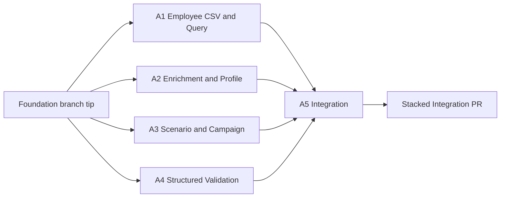

# 成員 A：Go Backend 平行 Worktree 實作計畫

> 狀態：Ready for parallel implementation
>
> Foundation implementation commit：`a9a2d221b770b29475efc2d1c8387ecdfac8412e`
>
> Parallel base ref：`origin/codex/feature-go-backend`（本文件合併後凍結）
>
> Frozen contract：`docs/api-contract.md`、`backend/schema.sql`

## 1. 目標與範圍

本計畫接續 `codex/feature-go-backend` 已完成的 Go、HTTP、domain、ports、SQLite repository foundation，將剩餘成員 A 工作拆為四個可同時執行的 worktrees，再由第五個 integration worktree 組裝。

本輪交付六個 endpoints：

| Owner | Endpoint | 成功狀態 |
|---|---|---|
| A1 Employee | `POST /employees/import` | `200` |
| A1 Employee | `GET /employees` | `200` |
| A1 Employee | `GET /employees/{id}` | `200` |
| A2 Profile | `POST /employees/{id}/enrich` | `200` |
| A3 Campaign | `POST /campaigns/generate` | `201` |
| A3 Campaign | `GET /campaigns/{id}` | `200` |

不在成員 A 範圍：approve、reject、simulate、landing、events、reports、真實 Search API、真實 LLM、CORS、登入與多租戶。這些功能不得順手加入。

## 2. 平行拓撲



四個 implementation agents 同時從同一 SHA 開工。A2、A3 只依賴 foundation 中的 `ports.StructuredValidator`，各自在單元測試注入 fake，因此不等待 A4。A5 只在 A1–A4 各自測試通過後開始合併與 wiring。

## 3. Worktree 建立

本文件提交並 push 後，`codex/feature-go-backend` 不再加入其他實作。建立 worktrees 前先 fetch 並記錄共同 base SHA；四個 worktrees 必須從同一個已凍結的 remote ref 建立：

```sh
git fetch origin codex/feature-go-backend
git rev-parse origin/codex/feature-go-backend
git worktree add -b codex/a-employee-api ../hackathon_2026-a-employee origin/codex/feature-go-backend
git worktree add -b codex/a-profile-enrichment ../hackathon_2026-a-profile origin/codex/feature-go-backend
git worktree add -b codex/a-campaign-generate ../hackathon_2026-a-campaign origin/codex/feature-go-backend
git worktree add -b codex/a-structured-validation ../hackathon_2026-a-structured origin/codex/feature-go-backend
```

A5 integration worktree 在四個實作分支完成後建立：

```sh
git worktree add -b codex/a-backend-integration ../hackathon_2026-a-integration origin/codex/feature-go-backend
```

如果任一 branch 或 path 已存在，先確認持有人與狀態，不得刪除、覆寫或靜默改名。

## 4. 全體不可變規則

除 A5 明確列出的 wiring 外，A1–A4 均不得修改：

- `backend/cmd/api/main.go`
- `backend/internal/domain/**`
- `backend/internal/ports/**`
- `backend/internal/store/**`
- `backend/internal/httpapi/**`
- `backend/schema.sql`、`backend/schema_embed.go`
- `docs/api-contract.md`
- `backend/Dockerfile`、`backend/compose.yaml`

只有 A4 可以修改 `backend/go.mod` 與 `backend/go.sum`。其他 agents 如認為需要 dependency，先以標準函式庫完成；若確實不可行，回報 integration owner，不自行改 module files。

所有 route modules 都在自己的 package 內實作 `httpapi.RouteRegistrar`。A1–A4 不在 composition root 註冊 routes。

共通實作規則：

- Handler 只處理 HTTP decode/encode 與錯誤映射；流程放在 service。
- Service 的 repository 欄位只接受 `internal/ports` interfaces，不得接受 concrete SQLite repository。允許 import `internal/store`，但僅可用於將 `ErrNotFound`／`ErrConflict` 翻譯為 module errors。
- 所有 I/O 接收 `context.Context`。
- JSON decoder 必須 `DisallowUnknownFields`，並拒絕第一個 JSON value 後的 trailing content。
- 錯誤使用 module-local sentinel errors；handler 透過 `errors.Is` 對應 HTTP 狀態。
- 所有 JSON response 使用 Frozen camelCase 欄位；slice 不得輸出 `null`。
- 不新增 `/api` prefix。Vite proxy 負責移除前端 `/api`。
- 不建立假的未完成功能 route 或 `501` response。
- 每個 agent 完成前執行 `go test ./...`、`go test -race ./...`、`go vet ./...`。

## 5. A1 — Employee CSV 與查詢 API

### Branch 與唯一所有權

- Branch：`codex/a-employee-api`
- Worktree：`../hackathon_2026-a-employee`
- 唯一可新增／修改：`backend/internal/employee/**`

### 固定 public constructors

```go
func NewService(repository ports.EmployeeRepository) *Service
func NewRoutes(service *Service, logger *slog.Logger) *Routes
func (routes *Routes) RegisterRoutes(router chi.Router)
```

### 實作內容

`Routes` 註冊：

```text
POST /employees/import
GET  /employees
GET  /employees/{id}
```

CSV parser 規則：

1. Request media type 必須是 `text/csv`；允許 `charset=utf-8`。不符合回 `400 invalid_content_type`。
2. Body 已由全域 middleware 限制為 2 MiB；遇到 `http.MaxBytesError` 回 `400 invalid_csv`。
3. Header 必須依序完全等於 `employee_id,display_name,email,department,title,company`。
4. `employee_id`、`display_name`、`email` trim 後不可為空；其餘欄位 trim 後可空。
5. 不做額外 email DNS 或網域驗證，`.test` 必須可匯入。
6. 先完整 parse request；CSV 語法錯誤使整份 request 回 `400 invalid_csv`，且不得寫 DB。
7. 欄位驗證錯誤只 skip 該 row；使用 `csv.Reader.FieldPos(0)` 取得實體起始行，header 為第 1 行，空白行依標準 parser 行為忽略。
8. 將所有有效 rows 一次傳給 `ImportEmployees`；repository 回傳的 bool 必須依序映射回原始 row。
9. `false` 代表 DB 或同一 CSV 內重複 `employee_id`，reason 固定為 `duplicate employee_id`。
10. `skipped` 包含欄位錯誤與重複列；`errors` 按 row 升冪排列。

缺少必填欄位的 reason 固定為 `missing employee_id`、`missing display_name` 或 `missing email`；同一列多個欄位缺失時只回第一個、依此順序判定。

Import response：

```go
type ImportResponse struct {
    Imported int         `json:"imported"`
    Skipped  int         `json:"skipped"`
    Errors   []RowError  `json:"errors"`
}

type RowError struct {
    Row    int    `json:"row"`
    Reason string `json:"reason"`
}
```

查詢規則：

- `GET /employees` 直接回 `[]domain.EmployeeSummary`；空結果為 `[]`。
- `GET /employees/{id}` 回 `domain.EmployeeDetails`。
- `store.ErrNotFound` 映射 `404 employee_not_found`。
- 其他 repository error 映射 `500 internal_error`，不得回傳 SQL 細節。

### 測試與驗收

- Parser：正常、CRLF、UTF-8、空檔、錯 header、欄位數錯誤、缺必填、重複與 malformed quotes。
- Service：全成功、部分 skip、repository rollback error、結果順序。
- Handler：media type、狀態碼、Frozen JSON shape、404 與 500。
- 使用 fake repository，不依賴 A2–A4。

Commit 建議：`feat(backend): add employee CSV and query APIs`

## 6. A2 — Enrichment Adapter 與 Profile Agent

### Branch 與唯一所有權

- Branch：`codex/a-profile-enrichment`
- Worktree：`../hackathon_2026-a-profile`
- 唯一可新增／修改：`backend/internal/profile/**`

Fixtures 放在 `backend/internal/profile/fixtures/`，由該 package 使用 `go:embed`；不得複製或修改 Frozen integration fixtures。

### 固定 public constructors

```go
func NewFixtureAdapter() (*FixtureAdapter, error)
func NewFixtureAgent() *FixtureAgent
func NewService(
    repository ports.EmployeeRepository,
    adapter ports.EnrichmentAdapter,
    agent ports.ProfileAgent,
    validator ports.StructuredValidator,
) *Service
func NewRoutes(service *Service, logger *slog.Logger) *Routes
```

### Fixture 與 Agent 行為

新增：

- `fixtures/search_E001.json`：對應 Demo User 的兩筆公開 evidence。
- `fixtures/search_default.json`：空 evidence，供非 E001 員工安全降級。

Evidence 必須包含 fact、nullable source URL、nullable confidence、source type 與 internal tags。Fixture adapter 先找 employee-specific fixture，找不到時使用 default；不存在或 JSON 損壞回 adapter error，不得杜撰資料。

Fixture Profile Agent 將 `ports.ProfileInput` 轉成 raw JSON：

- Identity 欄位只來自 Employee repository。
- Evidence tag 含 `event` 時推薦 `event_followup`，產生使用「可能」措辭的 risk signals。
- 無 evidence 時輸出空 `publicFacts`、空 `riskSignals`，推薦 `training_reminder`。
- 不產生家庭、健康、宗教、政治、財務或其他敏感資訊。
- 每項 fact 保留 adapter 提供的 source metadata，不補寫未知來源。

### Enrich Service 流程

1. `GetEmployee`；不存在回 module `ErrEmployeeNotFound`。
2. Adapter `Search`。
3. Agent `Generate`，feedback 為 nil。
4. `ValidateProfile`；若失敗，以 validation message 建立 `ValidationFeedback` 再 Generate 一次。
5. 第二次仍失敗，回 `ErrEnrichmentFailed`；不得呼叫 `ReplaceProfile`。
6. 通過後用 strict decoder 解碼 `domain.EmployeeProfile`。
7. 驗證輸出 employeeId、displayName、department 與 repository employee 完全一致。
8. 呼叫 `ReplaceProfile`，成功後再 `GetProfile` 回傳 canonical persisted result。

`Routes` 只註冊：

```text
POST /employees/{id}/enrich
```

Request media type 必須為 `application/json`，且 body 必須為單一空 JSON object `{}`；錯 media type 回 `400 invalid_content_type`，未知欄位或 trailing JSON 回 `400 invalid_request`。

錯誤映射：

- 員工不存在：`404 employee_not_found`
- Adapter、Agent、兩次驗證或 decode 失敗：`502 enrichment_failed`
- Repository 寫入失敗：`500 internal_error`

### 測試與驗收

- Adapter：E001、default fallback、corrupt/missing fixture。
- Agent：event evidence 與 empty evidence；identity/source preservation。
- Service：首次成功、第一次 invalid 後修復、兩次 invalid、不一致 identity、repository failure、不產生 partial write。
- Handler：`{}`、未知欄位、404、502、500、成功 JSON shape。
- 使用 fake validator，因此不等待 A4。

Commit 建議：`feat(backend): add fixture profile enrichment`

## 7. A3 — Scenario Agent 與 Campaign Generate

### Branch 與唯一所有權

- Branch：`codex/a-campaign-generate`
- Worktree：`../hackathon_2026-a-campaign`
- 唯一可新增／修改：`backend/internal/campaign/**`

Fixtures 放在 `backend/internal/campaign/fixtures/`，由該 package 使用 `go:embed`。

### 固定 public constructors

```go
type IDGenerator func() (string, error)

func NewFixtureScenarioAgent() (*FixtureScenarioAgent, error)
func NewCryptoIDGenerator() IDGenerator
func NewService(
    employeeRepository ports.EmployeeRepository,
    campaignRepository ports.CampaignRepository,
    agent ports.ScenarioAgent,
    validator ports.StructuredValidator,
    idGenerator IDGenerator,
) *Service
func NewRoutes(service *Service, logger *slog.Logger) *Routes
```

### Scenario fixtures 與內部 output

提供四個 allowlisted templates：

- `event_followup`
- `training_reminder`
- `benefit_update`
- `saas_security_notice`

Scenario Agent raw JSON 只包含：

```text
templateId, difficulty, subject, emailHtml, landingConfig,
decisionReason, safetyChecks
```

`campaignId`、`employeeId`、`status`、approval/rejection 欄位由 Service 補上，不屬於 Agent output。

Agent 以 Profile 的 `recommendedScenario` 選模板；不在 allowlist 時安全降級為 `training_reminder`。Fixture 的 email template 使用 `{{.DisplayName}}` 與不具模板語意的 `__LANDING_URL__` sentinel；先以 `html/template` render 並 HTML escape employee display name，再將 sentinel 換成字面值 `{{landingUrl}}`。後端不得 materialize URL。

每個 fixture 必須包含並通過：

- `no_real_credentials_requested`
- `no_sensitive_personal_data`
- `no_unsourced_personal_facts`
- `no_prohibited_impersonation`
- `cta_points_to_controlled_domain`

### Generate Service 流程

1. `GetEmployee`；不存在回 `ErrEmployeeNotFound`。
2. `employee.Profile == nil` 回 `ErrProfileRequired`。
3. Agent `Generate`，feedback 為 nil。
4. `ValidateScenario`；失敗時帶 feedback 重試一次。
5. 第二次仍失敗或 strict decode 失敗，回 `ErrGenerationFailed`，不得建立 Campaign。
6. Service policy 再驗證 template/difficulty allowlist、五個必要 safety checks 全部存在且 passed、測試品牌及 `{{landingUrl}}` placeholder。
7. 使用 `crypto/rand` 產生 16 bytes，編碼為 `c_` 加 32 位小寫 hex。
8. 建立 `domain.GeneratedCampaign`，固定 status `pending_review`，三個 review 欄位為 nil。
9. `CreateCampaign` 成功後回 persisted result。

`Routes` 註冊：

```text
POST /campaigns/generate
GET  /campaigns/{id}
```

Generate request 僅接受：

```json
{ "employeeId": "E001" }
```

Request media type 必須為 `application/json`；錯 media type 回 `400 invalid_content_type`。未知欄位、空 employeeId 或 trailing JSON 回 `400 invalid_request`。

錯誤映射：

- JSON 或 employeeId 無效：`400 invalid_request`
- 員工不存在：`404 employee_not_found`
- Campaign 不存在：`404 campaign_not_found`
- 尚未 enrich：`409 profile_required`
- Agent、validator、decode、policy 或 ID generation 失敗：`502 generation_failed`
- Repository failure：`500 internal_error`

### 測試與驗收

- 四個 fixtures 都能 parse 並產生允許模板。
- 未知 recommended scenario 安全降級。
- HTML escape、landing placeholder、五個 safety checks。
- ID 格式、ID generator error、重複 generate ID 不固定。
- Service：缺員工、缺 Profile、一次修復、兩次失敗、policy failure、無失敗殘留 Campaign。
- Handler：201、GET、400、404、409、502、500 與 Frozen response shape。
- 使用 fake validator，因此不等待 A4。

Commit 建議：`feat(backend): add fixture campaign generation`

## 8. A4 — Structured Output Validation

### Branch 與唯一所有權

- Branch：`codex/a-structured-validation`
- Worktree：`../hackathon_2026-a-structured`
- 可新增／修改：
  - `backend/internal/structured/**`
  - `backend/go.mod`
  - `backend/go.sum`

加入並鎖定 `github.com/santhosh-tekuri/jsonschema/v6 v6.0.3`。

### 固定 public constructor

```go
func NewValidator() (*Validator, error)
```

`Validator` 必須實作 foundation 的 `ports.StructuredValidator`。兩份 Draft 2020-12 schema 置於 `backend/internal/structured/schemas/` 並以 `go:embed` 載入：

- `profile.schema.json`
- `scenario.schema.json`

兩份 schema 共通要求：

- 所有必要欄位列入 `required`。
- 所有 object 設 `additionalProperties: false`。
- string 必要欄位至少一個非空白字元。
- array 欄位不可為 null。
- confidence 為 null 或 `0..1` number。
- source type 只允許 `live|fixture|manual`。
- difficulty 只允許 `low|medium|high`。
- Scenario output 不包含 service-owned campaign/status/review 欄位。
- safetyChecks item 僅驗證 shape；必要規則及 passed 狀態由 A3 policy validator 負責。

Validator 每次驗證前先確認 raw bytes 是單一 JSON document；語法錯誤、schema 錯誤及 trailing content 都回帶欄位位置的 error，但不得包含 prompt、secret 或整份 payload。

### 測試與驗收

- Frozen E001 profile 與 scenario-equivalent fixture成功。
- 缺 required、unknown property、錯 enum、confidence 越界、null array、trailing JSON 全部失敗。
- Validator 可安全重複及並行使用。
- `var _ ports.StructuredValidator = (*Validator)(nil)` 編譯檢查。

Commit 建議：`feat(backend): validate agent structured outputs`

## 9. A5 — Integration 與端到端測試

### Branch 與唯一所有權

- Branch：`codex/a-backend-integration`
- Worktree：`../hackathon_2026-a-integration`
- 唯一可修改／新增：
  - `backend/cmd/api/main.go`
  - `backend/internal/integration/**`
  - `backend/README.md`

A5 不修改 A1–A4 的 implementation。發現缺陷時回原 owner branch 修正後再 merge。

### 合併順序

在乾淨 integration worktree 依序合併：

1. `codex/a-structured-validation`
2. `codex/a-employee-api`
3. `codex/a-profile-enrichment`
4. `codex/a-campaign-generate`

預期不產生同檔衝突。若出現衝突，停止並比對 ownership；不得直接選 ours/theirs 掩蓋變更。

### Composition root

`cmd/api/main.go` 初始化順序固定：

1. config/logger/signal context
2. `store.Open`、`store.Migrate`、`store.New`
3. `structured.NewValidator`
4. A1 Employee service/routes
5. A2 fixture adapter、fixture profile agent、service/routes
6. A3 fixture scenario agent、crypto ID generator、service/routes
7. `httpapi.NewRouter(logger, employeeRoutes, profileRoutes, campaignRoutes)`
8. listener/server/graceful shutdown

任一 dependency 初始化失敗，啟動直接失敗並記錄不含 secret 的結構化錯誤。

### Integration tests

在 `internal/integration` 使用 `t.TempDir()` SQLite、真實 repositories、真實 validators、fixture agents 與 `httptest.Server`，完成：

1. 匯入 E001。
2. 查詢員工，確認 `hasProfile=false`。
3. Generate 先回 `409 profile_required`。
4. Enrich E001，確認兩筆 fixture facts 與 `sourceType=fixture`。
5. 再查詢員工，確認 `hasProfile=true` 且 profile shape 正確。
6. Generate 回 `201 pending_review`、隨機 campaign ID、五個 safety checks。
7. GET campaign 與 generate response 等價。
8. 重複匯入 E001 回 skip，不新增第二位員工。
9. Unknown employee/campaign 皆為 Frozen 404 envelope。

完成後再跑 Docker Compose smoke flow，確認 host `localhost:8080` 可執行同一條 API 鏈。

Commit 建議：`feat(backend): wire member A API workflow`

## 10. Agent 回報格式

每個 implementation agent 完成時必須回報：

```text
Branch:
Commit SHA:
Owned paths changed:
Tests run and results:
Known limitations:
Integration notes:
```

並附上：

```sh
git diff --name-only origin/codex/feature-go-backend...HEAD
```

輸出必須只落在各自 ownership；有越界檔案不得交付 A5。

## 11. PR 與同步策略

1. A1–A4 branch 可立即 push，供 code review，但先不互相 merge。
2. A5 將四支 feature branches merge 至 integration branch，開 stacked PR，base 暫設 `codex/feature-go-backend`。
3. Foundation PR 合併至 `main` 後：
   - 若 foundation branch tip 是新 `origin/main` 的 ancestor，直接把 integration PR base 改為 `main`。
   - 若 foundation 被 squash，將 integration branch 以 `origin/codex/feature-go-backend` 為 old base rebase onto 最新 `origin/main`，完整重跑驗證後 force-with-lease push。
4. 不把 A1–A4 直接 merge 回 foundation branch，避免擴張 foundation PR 的已凍結範圍。

## 12. 最終完成定義

- 六個成員 A endpoints 完全符合 Frozen contract。
- Fixture-only Demo 不依賴外部網路或 API key。
- Structured Output 初次驗證、一次修復、第二次失敗路徑都有測試。
- Profile replacement 與 Campaign creation 不留下 partial data。
- 所有 Handler 錯誤都使用 Frozen envelope 與 request ID。
- `go test ./...`、`go test -race ./...`、`go vet ./...`、production image build、Compose E2E 全部通過。
- `cmd/api` 只在 A5 integration branch 修改一次，A1–A4 無共享檔案衝突。
