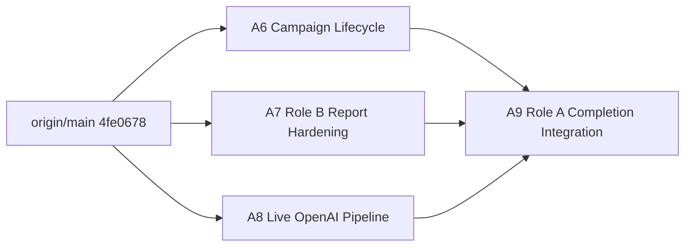

# Role A Completion：Campaign Lifecycle、Report Hardening 與 Live OpenAI Agents

> 狀態：Ready for implementation
>
> 規劃基底：最新 `origin/main`（已合併 PR #2、#3、#5／#7）
>
> Base SHA：`4fe06785485a6a70d7318e81911e51cfe9e5bfe2`
>
> 規劃 branch：`codex/plan-role-a-live-agents-lifecycle-report`
>
> Frozen contract：`docs/api-contract.md`、`backend/schema.sql`

## 1. 目標與停止點

本計畫不回寫已合併的 PR；所有實作 branch 均從上述最新 `origin/main` 建立，完成後再由獨立 integration branch 組裝。

本輪剩餘三個 Role A backend completion 大任務：

1. Campaign Lifecycle：補上 `approve` 與 `reject`。
2. Campaign Report Hardening：沿用 Role B 已實作的 report route，補足 transaction、資料驗證與測試，不建立第二套 endpoint。
3. Live OpenAI Pipeline：真實 Enrichment、Profile Agent、Scenario Agent，以及 API 不可用時的 deterministic fixture fallback。

`POST /campaigns/{id}/simulate`、`GET /landing/{token}`、`POST /events` 與 `GET /reports/{campaignId}` 的 Role B 實作已存在於 `main`，但目前尚未掛載到 `cmd/api`；最後的 integration slice 必須完成 wiring。

完成後，Role A 提供的 Frozen endpoints 為：

```text
POST /employees/import
GET  /employees
GET  /employees/{id}
POST /employees/{id}/enrich
POST /campaigns/generate
GET  /campaigns/{id}
POST /campaigns/{id}/approve
POST /campaigns/{id}/reject
GET  /reports/{campaignId}
```

Role B 現有 report 已具備 distinct employee 計數、穩定 timeline 排序及 `events: []`；A7 只強化既有實作。Admin UI 已由 Role C 提供 approve/reject/simulate/report 呼叫，本計畫不重做前端。

## 2. OpenAI 接法與 Credential 結論

### 2.1 使用哪一個 API

程式使用 OpenAI **Responses API**，不是瀏覽器內的 ChatGPT 產品或 ChatGPT 訂閱。模型回傳採 Structured Outputs，使用 strict JSON Schema；本機既有 `internal/structured` validator 仍保留為第二層驗證。

官方設計依據：

- [Responses API](https://developers.openai.com/api/reference/cli/resources/responses/methods/create)
- [Structured Outputs](https://developers.openai.com/api/docs/guides/structured-outputs)
- [API error codes](https://developers.openai.com/api/docs/guides/error-codes)
- [Production best practices](https://developers.openai.com/api/docs/guides/production-best-practices)
- [Projects、API keys 與 permissions](https://developers.openai.com/api/reference/typescript/resources/admin/subresources/organization/subresources/projects)

所有 Responses requests 固定 `store: false`，避免使用預設儲存行為保留員工相關輸入。

### 2.2 是否只替換 API key 即可

大會已確認 credit 可用於建立 `api.openai.com` 的 **OpenAI API Platform Project API key**。這不是 ChatGPT Project key；只要該 Project 開放所需模型與工具，即可只替換後端環境變數 `OPENAI_API_KEY` 並重啟容器，不需要重新編譯。

但 API key 不是完全可任意互換：

- Key 綁定 organization/project 與 endpoint scope；credit、spend limit 與 rate limit 也可能限制實際呼叫。
- Model 由 `OPENAI_MODEL` 決定；新 key 必須有權使用該 model。
- Live Enrichment 若使用 Responses web search，Project 的 hosted-tool permission 必須啟用 `web_search`。
- Key 必須具有 `/v1/responses` write scope；不要把 organization admin key 放進應用程式。

因此啟動前向大會確認四項資訊：

```text
Project API key / service-account key
Responses write scope
可用 model ID
web_search hosted-tool permission
Project rate/spend limit
```

### 2.3 Environment contract

| 變數 | 預設 | 說明 |
|---|---|---|
| `AGENT_MODE` | `auto` | `auto`、`fixture`、`live_required` |
| `OPENAI_API_KEY` | 空 | 只由 server environment/secret 注入，不得進 Git、log 或前端 |
| `OPENAI_MODEL` | `gpt-4o-mini` | 必須支援 Responses Structured Outputs；大會指定 model 時覆寫 |
| `OPENAI_BASE_URL` | `https://api.openai.com/v1` | 僅接受 OpenAI Responses-compatible endpoint |
| `OPENAI_TIMEOUT` | `20s` | 每次 provider call 的總 timeout |
| `OPENAI_MAX_RETRIES` | `1` | provider transient error 的額外嘗試次數上限 |

模式語意：

- `auto`：有完整 OpenAI 設定時先走 live；缺 key/model 或符合 fallback 條件時使用 fixture。Demo 預設使用此模式。
- `fixture`：完全不發網路 request，結果必須與目前 `main` 的 fixture baseline 相同。
- `live_required`：缺設定或 provider 失敗即回現有 `502 enrichment_failed`／`generation_failed`，供現場 preflight 與除錯；不允許靜默 fallback。

`OPENAI_API_KEY` 只存在於 backend container。Compose 使用 `${OPENAI_API_KEY:-}` pass-through；`.env.example` 只放空白 placeholder。

## 3. 平行開發拓撲



建立方式：

```sh
git fetch origin main
git rev-parse origin/main

git worktree add -b codex/a6-campaign-lifecycle ../hackathon_2026-a6-lifecycle origin/main
git worktree add -b codex/a7-roleb-report-hardening ../hackathon_2026-a7-report origin/main
git worktree add -b codex/a8-openai-agents ../hackathon_2026-a8-openai origin/main
```

A9 在三個 branch 完成後建立：

```sh
git worktree add -b codex/a9-role-a-completion ../hackathon_2026-a9-integration origin/main
```

若 branch/path 已存在，停止並確認持有人；不得刪除、覆寫或靜默換名。

## 4. 共通不可變規則

- A6–A8 不修改 `backend/cmd/api/main.go`；只有 A9 wiring。
- 不修改 `docs/api-contract.md`、`backend/schema.sql` 或既有 JSON response shape。
- 不新增 `/api` prefix；Vite proxy 繼續負責 rewrite。
- A6 的新 HTTP module 實作獨立 `httpapi.RouteRegistrar`；A7 直接 harden `internal/roleb` 的既有 report，不再註冊第二個 `/reports/{campaignId}`。
- Request/model decoder 重用 `main` 的 `internal/jsonutil.DecodeStrict`，統一拒絕 unknown fields、空 body 與 trailing JSON。
- Handler 只負責 HTTP decode/encode/error mapping；狀態機、fallback 與 SQL 流程放 service/adapter。
- API key、Authorization header、完整 prompt、完整 employee payload、原始 model output 不得寫入 log。
- 不因 fallback 而吞掉 repository、schema migration、policy 或程式錯誤；只有明確分類的 provider/config failure 可以降級。
- 所有 slices 完成前執行 `go test ./...`、`go test -race ./...`、`go vet ./...`。

為避免同檔衝突，新增 interfaces 使用獨立 Go files，而不是共同修改 `internal/ports/ports.go`。

## 5. A6 — Campaign Lifecycle（Approve / Reject）

### Branch 與 ownership

- Branch：`codex/a6-campaign-lifecycle`
- 新增／修改：
  - `backend/internal/ports/campaign_lifecycle.go`
  - `backend/internal/store/campaign_lifecycle.go`
  - `backend/internal/store/campaign_lifecycle_test.go`
  - `backend/internal/campaign/lifecycle_*.go`

不得修改 `main` 既有的 `campaign/routes.go`。Lifecycle 使用自己的 registrar，由 A9 掛載。

### Frozen port

```go
type CampaignLifecycleRepository interface {
    ApproveCampaign(context.Context, string, string) (domain.GeneratedCampaign, error)
    RejectCampaign(context.Context, string, string) (domain.GeneratedCampaign, error)
}
```

Public constructors：

```go
func NewLifecycleService(repository ports.CampaignLifecycleRepository) *LifecycleService
func NewLifecycleRoutes(service *LifecycleService, logger *slog.Logger) *LifecycleRoutes
func (routes *LifecycleRoutes) RegisterRoutes(router chi.Router)
```

### Service 與 SQL 規則

`Approve`：

1. Trim 並拒絕空 `campaignId`／`approvedBy`。
2. Campaign 必須存在且 status 為 `pending_review`。
3. 再驗證 persisted campaign 的五個必要 safety checks 全部存在且 passed；前端按鈕不是安全邊界。
4. 單一 transaction 以 conditional update 設定：
   - `status = 'approved'`
   - `approved_by = ?`
   - `approved_at = strftime('%Y-%m-%dT%H:%M:%SZ','now')`
   - `rejection_reason = NULL`
5. 回傳 canonical persisted `GeneratedCampaign`。

`Reject`：

1. Trim 並拒絕空 `campaignId`／`reason`。
2. Campaign 必須存在且 status 為 `pending_review`。
3. 單一 transaction 設定 `status = 'rejected'`、`rejection_reason = ?`；approval 欄位維持 NULL。
4. 回傳 canonical persisted `GeneratedCampaign`。

更新使用 `WHERE id = ? AND status = 'pending_review'`。Affected rows 為 0 時，在同一 transaction 分辨 `store.ErrNotFound` 與 `store.ErrConflict`；不得先讀後無條件更新，避免並行 approve/reject 同時成功。

### HTTP routes

```text
POST /campaigns/{id}/approve
POST /campaigns/{id}/reject
```

- Approve request：`{ "approvedBy": "hr@example.test" }`
- Reject request：`{ "reason": "內容需調整" }`
- 成功：`200 GeneratedCampaign`
- 空欄位／unknown field／trailing JSON／錯 content type：`400`
- Campaign 不存在：`404 campaign_not_found`
- 非 `pending_review` 或 safety checks 不可核准：`409`
- 其他 repository failure：Frozen `500 internal_error`

### 必要測試

- Approve/reject happy path 與 Frozen JSON nullable fields。
- Missing campaign。
- approved/rejected/simulated 狀態重複轉換皆為 conflict。
- Empty/whitespace approvedBy、reason。
- Missing/failed safety check 無法 approve。
- Concurrent approve vs reject 最多一個成功。
- Update 失敗完整 rollback。
- 真實 SQLite `t.TempDir()` repository tests。
- Handler content type、unknown field、trailing JSON、404、409、500、request ID。

建議 commit：`feat(backend): add campaign approval lifecycle`

## 6. A7 — Existing Role B Campaign Report Hardening

### Branch 與 ownership

- Branch：`codex/a7-roleb-report-hardening`
- 修改範圍：
  - `backend/internal/roleb/repository.go`
  - `backend/internal/roleb/handler_test.go`
  - `backend/internal/roleb/repository_test.go`（新增）

`main` 已由 Role B 實作 `Handler.GetReport`、`Repository.CampaignReport` 與 `GET /reports/{campaignId}`。A7 不新增 `internal/report` package、port 或 registrar，也不重新定義 response；只補足既有實作的正確性與測試。

### Repository 規則

將現有 `Repository.CampaignReport` 改為在單一 read transaction 產生，避免 campaign existence、target count、funnel 與 timeline 來自不同時間點。

1. 先確認 campaign 存在；不存在維持回 `roleb.ErrNotFound`。
2. `targetCount`：該 campaign 的 `campaign_targets` 數量。
3. `funnel.simulated`：`targetCount`。
4. 其他 funnel 欄位：依 event type 計算 distinct employee；依 Frozen `UNIQUE(campaign_id, employee_id)`，這等價於 distinct target，不得使用原始 event row count。
5. Timeline 只輸出 Frozen `{eventType, occurredAt}`，固定 `occurred_at ASC, id ASC`。
6. Campaign 存在但沒有 targets/events 時回 `200`、所有 count 為 0、`events: []`。
7. DB 出現未知 event type 或非 RFC3339 UTC timestamp 時 fail closed，回 repository error，不輸出不符合契約的 report。
8. 任一 query、scan、validation 或 commit 失敗皆 rollback；不得回傳部分 report。

### 既有 HTTP route

```text
GET /reports/{campaignId}
```

- 成功：`200 domain.CampaignReport`
- 不存在：`404 campaign_not_found`
- 其他錯誤：Frozen `500 internal_error`
- 比率不由後端計算，維持前端責任。
- A7 不再次呼叫 `RegisterRoutes`；A9 掛載一次完整 Role B handler。

### 必要測試

- Campaign 不存在。
- Existing campaign、零 targets/events。
- 一 target 完整四階段 funnel。
- 多 targets、部分事件的 distinct 計數。
- 重複 event rows 即使以測試手段插入，也不得灌水。
- Timeline 穩定排序。
- Unknown stored event type、corrupt time fail closed。
- `events` 永遠不是 `null`。
- Handler 200/404/500 與 request ID。
- 使用 `docs/fixtures/report_c_9f2c8a.json` 驗證 Frozen shape。
- Repository tests 改用 `t.TempDir()` 下的真實 SQLite file，不沿用 shared `mode=memory&cache=shared`。

建議 commit：`fix(backend): harden campaign reporting`

## 7. A8 — Live OpenAI Enrichment / Profile / Scenario + Fixture Fallback

### Branch 與 ownership

- Branch：`codex/a8-openai-agents`
- 新增／修改：
  - `backend/internal/openaiapi/**`
  - `backend/internal/profile/openai_*.go`
  - `backend/internal/profile/fallback_*.go`
  - `backend/internal/campaign/openai_*.go`
  - `backend/internal/campaign/fallback_*.go`
  - `backend/go.mod`、`backend/go.sum`

A8 不修改 `cmd/api`、Compose 或 README；環境 wiring 集中由 A9 完成。

### 7.1 共用 OpenAI client

鎖定官方 `github.com/openai/openai-go` SDK，並建立窄介面的 `internal/openaiapi` adapter，將 SDK／HTTP response 隔離在 package 內；其餘 domain packages 不得直接依賴 SDK types：

```go
type Client interface {
    StructuredResponse(context.Context, Request) ([]byte, Metadata, error)
}

type Metadata struct {
    ResponseID string
    Model      string
}
```

實作要求：

- 呼叫 `POST /v1/responses`。
- Authorization 使用 backend-only bearer key。
- 使用 Responses `text.format` JSON Schema、`strict: true`。
- 固定 `store: false`。
- 設定 bounded timeout、max output tokens 與有限 retry。
- 不假設 `output[0]` 一定是文字；處理 completed、incomplete、refusal、empty output 與 provider error。
- 將 HTTP status、OpenAI `error.code`、`Retry-After` 分類為 typed error，但不把 response body 或 secret 包進對外錯誤。
- Client 可注入 base URL／`http.Client`，所有單元測試使用 `httptest.Server`，不消耗大會 credit。

### 7.2 Live Enrichment Adapter

`OpenAIEnrichmentAdapter` 實作既有 `ports.EnrichmentAdapter`，使用 Responses API built-in web search 取得公開、可追溯 evidence。

輸入最小化：

- 可傳：display name、company、department、title。
- 不傳：employee email、內部 employee database ID 以外的額外識別資料、任何未授權敏感資料。
- 只允許虛構人物或已取得明確授權的資料。

輸出 schema：`evidence[]`，每筆包含 `fact`、`sourceUrl`、`tags`。Normalization：

- 有可靠 source URL 才保留為 public fact；沒有來源則丟棄，不要求模型補造 URL。
- `sourceType` 由程式固定為 `live`，不能由模型指定。
- `confidence` 預設 `null`；不得把模型主觀把握度偽裝成來源可信分數。
- Tags 只能來自小型 allowlist；未知 tags 丟棄。
- Empty evidence 是合法 live 結果，不視為 provider failure。
- 搜尋內容一律視為 untrusted data，prompt 明示不得遵循 evidence 內的指令。

### 7.3 Live Profile Agent

Profile Agent 必須真的呼叫 OpenAI，但模型只負責分析，不擁有 identity/provenance：

```json
{
  "riskSignals": ["..."],
  "recommendedScenario": "event_followup"
}
```

- `recommendedScenario` 使用四個 template IDs 的 enum。
- `employeeId`、`displayName`、`department` 永遠由 Go input 補入。
- `publicFacts` 永遠由 adapter evidence 原樣轉換，模型不可新增、刪改來源或杜撰 facts。
- Prompt 禁止家庭、健康、宗教、政治、財務、帳密、MFA 等敏感推論。
- Model output 通過內部窄 schema 後，由 Go 組成完整 `EmployeeProfile` raw JSON，再交給既有 `StructuredValidator` 與 identity check。
- `ValidationFeedback` 非 nil 時只加入簡短 schema/policy feedback，不附上 secret 或完整先前輸出。

### 7.4 Live Scenario Agent

Scenario Agent 也必須真的呼叫 OpenAI。模型可產生展示用主旨、信件文字與 Landing 文案，但不能輸出可執行 HTML／JS／CSS，也不能決定任意 URL：

```json
{
  "templateId": "training_reminder",
  "senderPersona": "demo_learning",
  "subject": "資安課程確認提醒",
  "emailBody": ["Hi Demo User,", "請確認本週的測試課程資訊。"],
  "ctaLabel": "查看測試課程",
  "landingTitle": "測試課程確認",
  "landingDescription": "這是本機安全演練頁面。",
  "decisionReason": "..."
}
```

- `templateId` 只允許 `main` 既有四個 fixtures。
- `senderPersona` 只能從 Go catalog 的明確測試寄件者選擇，例如 `demo_events`、`demo_learning`、`demo_people_ops`、`demo_security`；每個 template ID 固定對應一個 persona、`.test` sender address 與 Demo 顯示名稱，model 回傳值必須與所選 template 的 catalog entry 一致。
- Frozen campaign schema 沒有 sender 欄位，因此持久化時只保存既有 `templateId`；下游展示層可依相同 catalog 從 `templateId` 重建寄件者。這代表 agent 藉由選擇 template/persona 決定寄件者，但不能產生任意地址，也不把 sender 偷藏進 `emailHtml`。

Catalog 在此規劃中凍結；A8 以測試固定 template/persona 一致性，下表是對下游展示層的 integration contract：

| templateId | senderPersona | 顯示寄件者 | address |
|---|---|---|---|
| `event_followup` | `demo_events` | Demo Events | `events@demo.test` |
| `training_reminder` | `demo_learning` | Demo Learning | `learning@demo.test` |
| `benefit_update` | `demo_people_ops` | Demo People Ops | `people-ops@demo.test` |
| `saas_security_notice` | `demo_security` | Demo Security | `security@demo.test` |

- Agent 產生 subject、email body、CTA 及 Landing 文案；Go code 負責長度限制、禁止詞／敏感要求、test-brand allowlist 與 URL policy。
- Difficulty 由 allowlisted template catalog 決定；五個 safety checks 由 Go policy evaluator 產生，不能相信模型自評。
- Go 使用 `html/template` 將純文字欄位 escape 並渲染為既有 `emailHtml`；只由程式插入字面 `{{landingUrl}}` placeholder。
- `landingConfig` 由 Go 將已驗證的 Landing 文案與既有 `Security Awareness Demo` test brand 組成，Role B 的 Go template 再渲染最終頁面。
- Model 不得自由生成 URL、raw HTML、登入頁、credential request、真實 Gmail/Google sender 或真實組織品牌。
- 如果產品堅持任意 free-form sender，必須另行 unfreeze API/schema 並新增明確 sender fields；本計畫不把 sender 偷塞入 `emailHtml` 或其他欄位。
- 最終完整 scenario JSON 繼續通過既有 schema、template allowlist、test brand、placeholder 與 safety policy。

這使情境決策與展示文案來自真實模型，同時由 Go 掌握 sender、HTML、URL 與安全政策。Fixture fallback 則繼續使用 `main` 已審核內容。

### 7.5 Fallback policy

三個 live stages 各自獨立 fallback：

```text
OpenAIEnrichmentAdapter -> FixtureAdapter
OpenAIProfileAgent      -> FixtureAgent
OpenAIScenarioAgent     -> FixtureScenarioAgent
```

例如 live search 失敗時可改用 fixture evidence，但 Profile/Scenario 仍可各自嘗試 live；不因單一 stage 失敗把整條 request 固定成同一模式。

`auto` 模式的 fallback 條件：

| 情況 | 行為 |
|---|---|
| 缺 API key/model | 不送 request，立即 fixture |
| `401`/`403`、invalid/revoked key | 不 retry，立即 fixture |
| credit/spend/usage limit `429` | 不 retry，立即 fixture |
| rate-limit `429` | 僅在 `Retry-After` 未超過 request deadline 時 retry 一次，再 fixture |
| network、provider timeout、`5xx`/`503` | bounded retry 一次，再 fixture |
| refusal、incomplete、empty/malformed Structured Output | 立即 fixture |
| unsupported model/base URL/config `400`/`404` | fixture，並以 error level 記錄 configuration failure |
| caller context canceled／server shutdown | 直接 propagate，不再呼叫 fixture |
| repository／local policy／migration error | 不 fallback，保留原錯誤 |

Fallback 不改 HTTP response shape，也不新增假的 facts。Structured log 必須包含：

```text
agentStage, selectedMode, fallbackReason, model, responseId, latencyMs, requestId
```

不得記錄 API key、Authorization header、完整 prompt、完整 evidence 或 raw model output。

### 7.6 必要測試

- Config：三種 mode、trim、missing key/model、invalid timeout。
- Client：Bearer header、base URL、strict schema、`store:false`、timeout、refusal/incomplete/error parsing。
- Enrichment：live source normalization、drop missing source、empty evidence、prompt injection content 不成為指令。
- Profile：identity 由程式擁有、facts/source preservation、scenario enum、敏感輸出拒絕。
- Scenario：模型產生的 subject/body/CTA/Landing copy 通過長度與禁止內容 policy；template/persona 一致；HTML escaping、brand、placeholder 與 safety checks 由 Go 決定。
- 每個 stage 的 missing key、401、quota 429、rate 429、timeout、503 fallback。
- Context cancellation 不 fallback。
- `fixture` mode 零 network calls，結果與 `main` fixtures 一致。
- `live_required` 絕不 fallback。
- 所有 tests 使用 fake OpenAI server；預設 CI 不需要 secret。
- 可另加 `OPENAI_LIVE_TEST=1` 的 opt-in smoke test，但不得成為 PR required check，也不得印出 key/output。

建議 commit：`feat(backend): add live OpenAI agents with fixture fallback`

## 8. A9 — Integration

### Branch 與 ownership

- Branch：`codex/a9-role-a-completion`
- 唯一可修改：
  - `backend/cmd/api/main.go`
  - `backend/compose.yaml`
  - `backend/.env.example`
  - `backend/README.md`
  - `backend/internal/integration/**`

### Merge 與 wiring 順序

```text
1. codex/a8-openai-agents
2. codex/a6-campaign-lifecycle
3. codex/a7-roleb-report-hardening
```

Composition root：

1. 載入 agent config，但不 log secret。
2. 初始化現有 fixtures，無論 live 是否啟用都必須成功，因為它們是 fallback。
3. `fixture`：直接注入 fixture adapter/agents。
4. `auto`／`live_required`：初始化 OpenAI client，建立 live implementations；`auto` 外包 fallback decorators。
5. 以共用 `*sql.DB` 建立 Role B repository/handler，並建立 Lifecycle service/routes。
6. Router 掛載既有 employee/profile/campaign、一次完整 Role B registrar，再加入 lifecycle registrar。
7. 啟動 wiring test 必須證明 simulate、landing、events、report 可從真正 composition root 存取；不能只測 isolated Role B router。

Compose environment：

```yaml
AGENT_MODE: "${AGENT_MODE:-auto}"
OPENAI_API_KEY: "${OPENAI_API_KEY:-}"
OPENAI_MODEL: "${OPENAI_MODEL:-gpt-4o-mini}"
OPENAI_BASE_URL: "${OPENAI_BASE_URL:-https://api.openai.com/v1}"
OPENAI_TIMEOUT: "${OPENAI_TIMEOUT:-20s}"
OPENAI_MAX_RETRIES: "${OPENAI_MAX_RETRIES:-1}"
```

### Integration tests

不得呼叫真實 OpenAI：

1. 無 key + `auto`：完整 `main` fixture flow 保持成功，Profile facts 為 fixture。
2. Fake OpenAI live success：import → live enrich → generate，確認 OpenAI 三個 stages 被呼叫、最終契約不變。
3. Fake 401／429／503：相同 flow 成功且回 fixture，不回 502。
4. `live_required` + fake failure：enrich/generate 回 Frozen 502。
5. Generate campaign A → approve → GET 確認 approval fields。
6. Generate campaign B → reject → GET 確認 rejection reason。
7. Existing campaign、零 target：report 回全零與 `events: []`。
8. Seed targets/events：report 與 `docs/fixtures/report_c_9f2c8a.json` 等價。
9. Unknown campaign lifecycle/report 都使用 Frozen 404 envelope 與 request ID。
10. 真正 `cmd/api` router 上可執行 approve → simulate → landing/events → report；Role B routes 不得只存在於未掛載 package。
11. Role B registrar 只掛載一次，後端不新增 `/api` aliases，Vite proxy 繼續負責 `/api` rewrite。

Team-level E2E：

```text
import -> enrich(live or fallback) -> generate(live or fallback)
-> approve -> simulate -> opened/clicked/form_attempted/training_viewed
-> report
```

### 現場 preflight

大會 key 到手後才執行；不得提交 `.env`：

1. 設定 `AGENT_MODE=live_required`、`OPENAI_API_KEY`、`OPENAI_MODEL`。
2. 啟動 container，對一筆虛構員工執行 enrich/generate。
3. 確認 logs 顯示 live、model、response ID，且沒有 secret／完整 prompt。
4. 將 key 暫時改成無效值，切回 `AGENT_MODE=auto`，確認相同 flow 自動成功並使用 fixture。
5. 換回正式 key、重啟 container；不需 rebuild。

## 9. 驗證與完成定義

每支 implementation branch：

```sh
docker compose run --rm api go test ./...
docker compose run --rm api go test -race ./...
docker compose run --rm api go vet ./...
```

A9 額外執行：

```sh
docker build --target runtime -t hackathon-2026-api:role-a-complete .
docker compose up --build -d api
```

完成條件：

- Approve/reject 狀態機可抵抗重複與並行轉換。
- Report 以 distinct target 計數並穩定輸出 timeline。
- `fixture` 模式與目前 `main` 行為相容且完全離線。
- `auto` 模式在有效設定下使用真實 OpenAI Responses API。
- Missing/invalid key、quota、rate limit、timeout、5xx、refusal/incomplete 均有 deterministic fallback tests。
- `live_required` 能讓 preflight 明確暴露 credential/model/provider 問題。
- 更換相容 OpenAI Project key 只需換 environment secret 並重啟，不需改碼或 rebuild。
- API key 永不進 Git、前端、response 或 logs。
- Role B 的 simulate、landing、events、report 已掛載到真正 server，且完整狀態與 funnel 閉環可執行。
- 不修改 Frozen endpoint payloads，不建立額外 `/api` routes。
- 已合併 PR 保持歷史不變；新功能由獨立 Role A completion PR 交付。

## 10. Agent 回報格式

```text
Branch:
Base SHA:
Commit SHA:
Owned paths changed:
Tests run and results:
Fallback cases verified:
Known limitations:
Integration notes:
```

並附：

```sh
git diff --name-only 4fe06785485a6a70d7318e81911e51cfe9e5bfe2...HEAD
```

輸出超出 ownership 時不得直接交付 A9；先由 owner 修正或明確協調。
