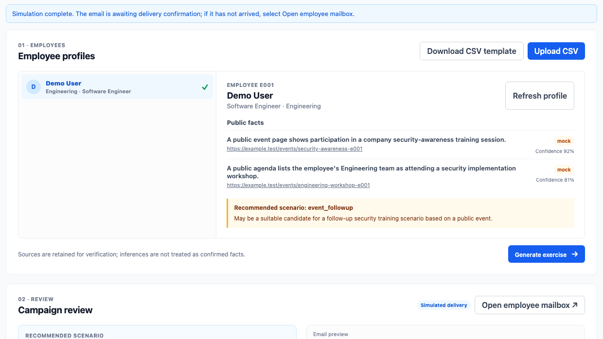
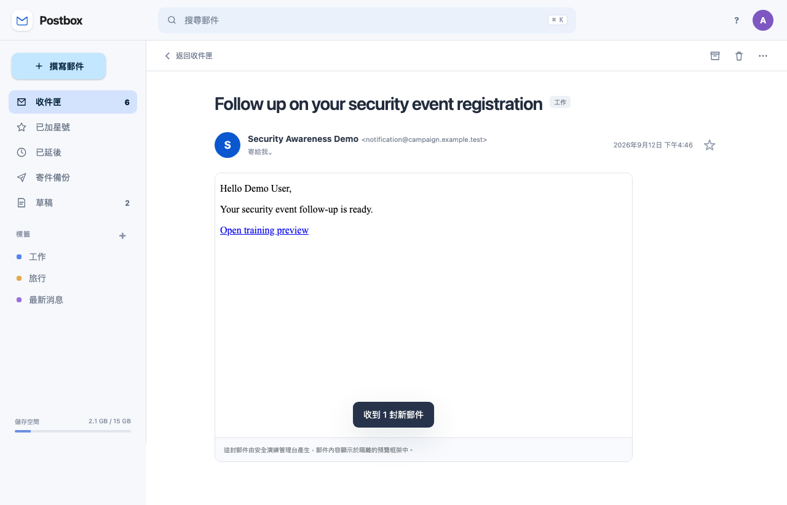
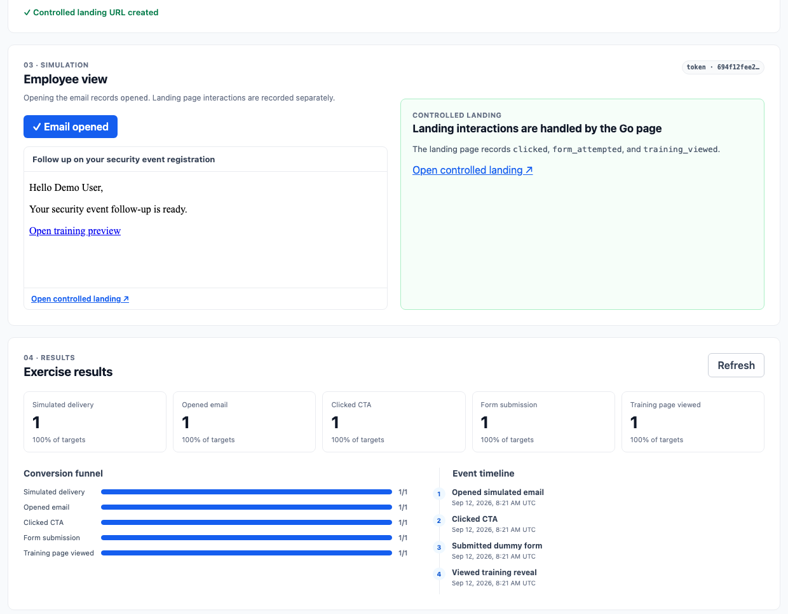

# SimSafe
## Turn risky clicks into safer habits

**A controlled, privacy-first phishing-training workflow for authorized teams.**

`Authorized training only · No real credential collection · Human approval required`

**Say (15 sec):** “SimSafe helps security teams run realistic training while keeping the experience safe, respectful, and measurable.”

---

# The training gap

## Generic simulations are easy to ignore.

- **Relevant** scenarios teach better than one-size-fits-all templates.
- **Unsafe** simulations can damage employee trust.
- Teams still need evidence of what learning happened.

### Our answer
**Role-aware context → approved simulation → immediate learning → measurable outcome**

**Say (25 sec):** “The challenge is not sending a more convincing email. It is making training relevant without using private vulnerabilities, then showing whether people learned.”

---

# Safe by design

## Personalization has boundaries.

| We use | We never use |
| --- | --- |
| Authorized employee and work-role context | Private social data or sensitive personal information |
| Source-labelled facts, including mock data | Real passwords, MFA codes, or payment details |
| Human campaign approval | Unreviewed live delivery |

**One rule:** record the learning event—not the form input.

**Say (25 sec):** “SimSafe is deliberately not a phishing tool. Every campaign is controlled, reviewed by a human, and designed so dummy form values are never transmitted or stored.”

---

# From context to an approved exercise

**1.** Select an employee profile  **2.** Review context and safety checks  **3.** Approve before simulation

*Actual end-to-end demo capture. Public facts in this demo are explicitly labelled “mock.”*

**Say (35 sec):** “Here is the console. An admin sees the profile context and where it came from, reviews a proposed training scenario, and checks the guardrails. Simulation stays locked until approval.”

---

# Employee view: a realistic, controlled inbox

The employee receives a **clearly controlled training email** in a familiar mailbox view, then chooses whether to open the training preview.

*Actual end-to-end demo capture. The inbox is a local simulated mailbox; no real email is sent.*

**Say (30 sec):** “This is the employee experience. The message is delivered to a realistic but controlled inbox. Opening it records only an exercise event, and the training link leads to our controlled landing page.”

---

# A learning loop, not a gotcha

**Simulated email** → **controlled landing page** → **training reveal** → **funnel + event timeline**

- The employee gets an explanation after the dummy submission.
- The team sees aggregate exercise progress: delivered, opened, clicked, submitted, and trained.

*Actual end-to-end demo capture; this screen shows one completed demo journey.*

**Say (30 sec):** “The click does not end in a punishment. It opens a controlled training page and then a learning reveal. The dashboard records only the progression through the exercise, so teams can improve training rather than shame individuals.”

---

# Why SimSafe

## Make security training **relevant, safe, and measurable.**

**Relevant**  
Work-role-aware scenarios instead of generic templates.

**Safe**  
Authorized scope, review gate, controlled links, and no credential capture.

**Measurable**  
A clear event funnel from simulated delivery to training viewed.

### SimSafe turns a risky moment into a teachable one.

**Say (20 sec):** “Our MVP already demonstrates the complete controlled journey. Next, we would expand role-based scenarios and learning content while preserving the same privacy and approval boundaries. Thank you.”
